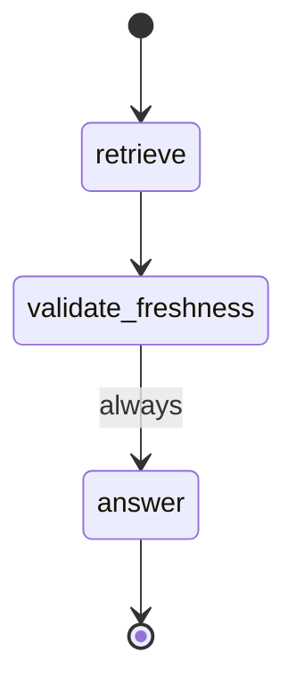
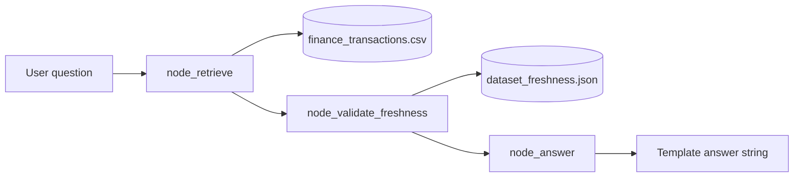
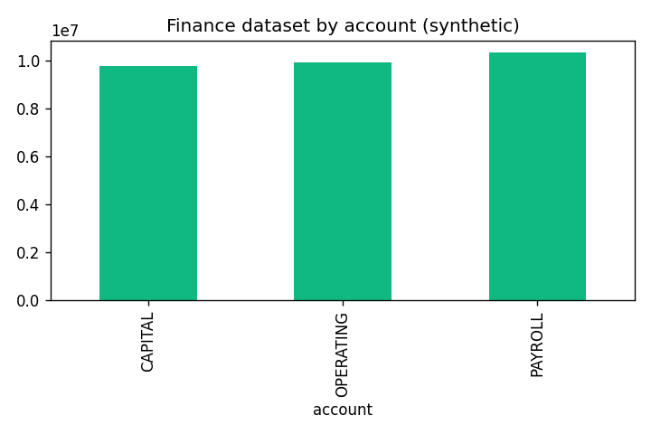

# LangChain / LangGraph Analyst Lab (Local Simulation)

**Author:** Faiz Elahi · **Type:** EDUCATIONAL LAB · **Default: no API keys, no live LLM**

---

## Educational disclaimer / synthetic data

This lab teaches **graph-shaped analyst workflows** (retrieve → validate → answer) using a small **`TeachingGraph`** class that mirrors LangGraph’s “nodes mutate shared state” idea. It is **not** a licensed LangGraph Cloud deployment and **does not** call external LLM APIs unless you explicitly enable optional hooks in `src/llm_stub.py` with `ENABLE_LIVE_LLM=1` and your own API key.

Finance transactions and freshness metadata are **synthetic**. Use honest labeling in portfolios: *“Local simulation of analyst guardrails and retrieval; templates instead of production LLM generation.”*

---

## Problem statement (detailed)

Production “AI analyst” features rarely jump straight from a user question to an model answer. Teams insert **retrieval** over approved datasets, **policy gates** (freshness, row limits, PII rules), and only then **generation**. LangGraph popularizes this as an explicit **state graph** where each node updates shared state.

Without spending on APIs, students still need to:

1. Define **`AnalystState`** (question, retrieved rows, freshness flag, answer).
2. Chain **pure Python nodes** the way LangGraph chains callables.
3. Observe how a **freshness failure** blocks analytics narratives— a common real-world SLA pattern.

This lab uses one CSV (`finance_transactions.csv`) and a JSON freshness file to keep focus on **control flow**, not vector database operations.

---

## Why this tool

| Approach | Gap |
|----------|-----|
| Single prompt to ChatGPT | No retrieval audit trail, no freshness gate |
| Raw pandas script | No explicit graph / node vocabulary for interviews |
| Full LangGraph + LLM | Cost, keys, and nondeterminism on day one |

The **`TeachingGraph`** pattern lets you first **master state and edges**, then optionally refactor the same nodes into a real `StateGraph` in exercises.

---

## Architecture







See: [`docs/architecture.md`](docs/architecture.md)

---

## Dataset dictionary (tables / columns)

### `data/finance_transactions.csv`

| Column | Description |
|--------|-------------|
| `txn_id` | Synthetic transaction identifier |
| `account` | `OPERATING`, `PAYROLL`, or `CAPITAL` |
| `amount_usd` | Signed synthetic amount |
| `category` | `AP`, `AR`, `TRANSFER`, or `FEE` |
| `posted_at` | ISO timestamp string |

### `data/dataset_freshness.json`

| Field | Description |
|-------|-------------|
| `last_refreshed_utc` | ISO UTC timestamp used by freshness gate (7-day SLA in code) |

Regenerate both via `scripts/generate_synthetic_data.py` (updates freshness to “now”).

---

## Prerequisites

- Python 3.10+
- `pandas` (see `requirements.txt`)
- No API keys for default run

---

## Step-by-step: how to run

### Windows PowerShell

```powershell
cd langchain-langgraph-analyst-lab
python -m venv .venv
.\.venv\Scripts\Activate.ps1
pip install -r requirements.txt
python scripts/generate_synthetic_data.py
python scripts/run_lab.py
python scripts/render_docs_images.py
```

### Optional bash

```bash
cd langchain-langgraph-analyst-lab
python3 -m venv .venv && source .venv/bin/activate
pip install -r requirements.txt
python scripts/generate_synthetic_data.py
python scripts/run_lab.py
python scripts/render_docs_images.py
```

---

## File-by-file walkthrough

| Path | Role |
|------|------|
| `src/graph_analyst.py` | `AnalystState`, nodes, `TeachingGraph`, demo `main()` |
| `src/llm_stub.py` | Optional live LLM hook (disabled by default) |
| `scripts/generate_synthetic_data.py` | Writes CSV + freshness JSON |
| `scripts/run_lab.py` | Invokes `graph_analyst.main()` |
| `scripts/render_docs_images.py` | Builds `docs/images/account_totals.png` |
| `docs/architecture.md` | Extended design notes |

### Node behavior (matches source)

1. **`node_retrieve`** — Loads CSV; filters by keywords (`payroll`, `operating`, `fee`) else top 5 amounts; stores up to 10 rows in state.
2. **`node_validate_freshness`** — Reads JSON; sets `freshness_ok` if age ≤ 7 days.
3. **`node_answer`** — If stale, failure template; else sums `amount_usd` of retrieved rows in template text.

---

## Expected outputs and how to interpret them

Example stdout (questions from `main()`):

```text
Q: Summarize payroll activity
A: Template analyst answer for 'Summarize payroll activity': retrieved N rows; sum(amount_usd)=...

Q: What are the largest operating amounts?
A: ...
```

If you manually set `last_refreshed_utc` to an old date, expect:

```text
Template: dataset freshness check FAILED — refresh finance_transactions.csv.
```

Chart PNG summarizes account-level totals for documentation—not audit evidence.

---

## Results interpretation

- **Retrieval is rule-based**, not embedding-based—wrong keywords mean “top amounts” default path.
- **Freshness gate is binary**—production systems might warn, partial answer, or route to human review.
- **Template answers** include explicit `sum(amount_usd)` so you can verify against pandas manually.

---

## Glossary (8+ terms)

1. **State graph** — Workflow where nodes read/write shared state object.
2. **AnalystState** — Dataclass holding question, rows, flags, and answer.
3. **Node** — Single step function `AnalystState → AnalystState`.
4. **TeachingGraph** — Minimal sequential invoker mimicking LangGraph execution order.
5. **Freshness gate** — Policy check before returning analytics text.
6. **RAG** — Retrieval-augmented generation; lab implements retrieval + templates.
7. **Grounding** — Basing output on retrieved rows (sums computed from state).
8. **LangGraph** — Library for stateful agent graphs; optional exercise to adopt officially.
9. **SLA** — Here, 7-day max dataset age enforced in code.

---

## Common mistakes (5+)

1. Claiming **production LangGraph** usage without noting simulation/templates.
2. Regenerating CSV but **not** freshness JSON (or vice versa)—stale gate triggers unexpectedly.
3. Expecting **multi-step tool calling**—not implemented.
4. Enabling **`ENABLE_LIVE_LLM`** in shared screenshots without redacting keys.
5. Comparing template sums to chart PNG without aligning **filter logic**.
6. Installing **`langgraph`** but not refactoring nodes—exercise left incomplete.

---

## Exercises (5+)

1. Add conditional path to **`human_review`** when any `abs(amount_usd) > 100000`.
2. Install **`langgraph`** and wrap the same three nodes in a real `StateGraph`.
3. Log retrieved **`txn_id`** list to an audit file per question.
4. Add a **`node_summarize`** that produces bullet text before answer node.
5. Swap keyword retrieval for **pandas query** mini-language with validation.
6. Connect freshness SLA to **Prefect flow** from `prefect-orchestration-lab`.

---

## Limitations / simulation vs production

| This lab | Production analyst stack |
|----------|---------------------------|
| Single CSV | Warehouse + RLS + catalogs |
| Keyword filters | Vector DB + metadata filters |
| No checkpointing | Persistent graph state, human-in-loop |
| Templates | LLM with eval harness |
| No tools | SQL/API tool nodes |

---

## Related labs

- [`palantir-aip-analyst-sim`](../palantir-aip-analyst-sim/) — CSV corpus + keyword retrieval Q&A.
- [`prefect-orchestration-lab`](../prefect-orchestration-lab/) — Schedule dataset refresh before analyst runs.
- [`apache-superset-dashboard-as-code-lab`](../apache-superset-dashboard-as-code-lab/) — BI-facing KPIs vs chat answers.
- [`financial-risk-portfolio-lab`](../financial-risk-portfolio-lab/) — More finance analytics patterns.

---

**Author:** Faiz Elahi · Educational simulation only.
